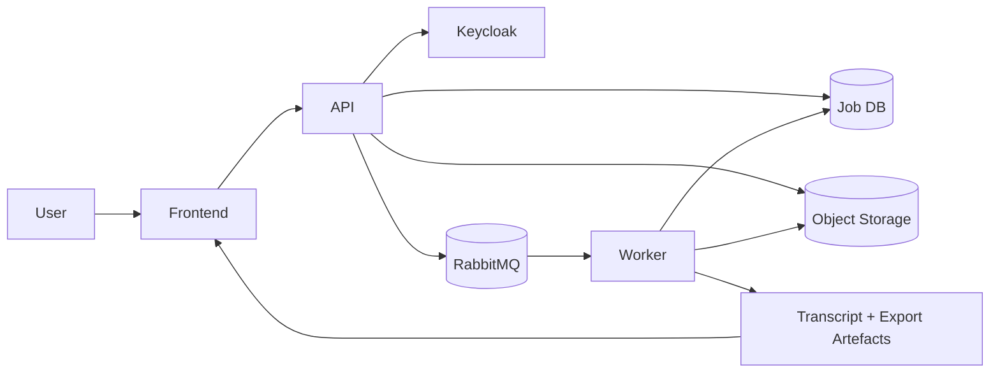
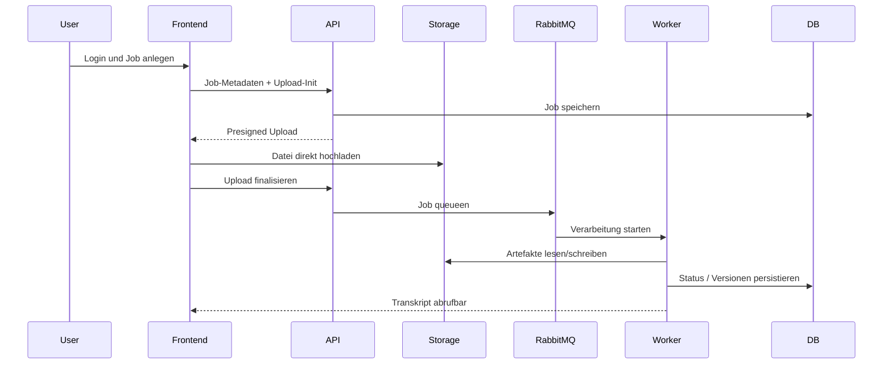
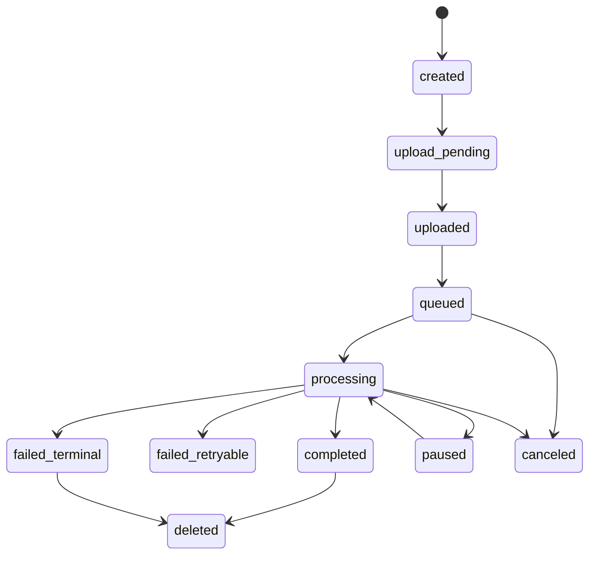

# EvidoX

EvidoX ist die On-Prem Plattform um WhisperX herum: WhisperX liefert die Transkriptions- und Alignment-Engine, EvidoX liefert den produktionsfaehigen Betriebs- und Review-Layer darueber.

## Kurzueberblick
- EvidoX loest die Probleme, die eine reine ASR-Library nicht adressiert: grosser Upload, Queue/Worker-Orchestrierung, Mandantenfaehigkeit, Auditierbarkeit, Export und Korrekturmodus.
- WhisperX bleibt die fachliche Transkriptionsbasis fuer ASR, Alignment und Speaker-Diarization.
- Die Details liegen in der Doku unter `docs/`; diese README ist der Einstieg, nicht der Ort fuer die normativen Feinspezifikationen.

## Inhaltsverzeichnis
- [Was ist EvidoX?](#was-ist-evodox)
- [WhisperX Core vs EvidoX Plattform](#whisperx-core-vs-evodox-plattform)
- [Welche Probleme loest EvidoX?](#welche-probleme-loest-evodox)
- [Ist vs Zielbetrieb](#ist-vs-zielbetrieb)
- [Architekturueberblick](#architekturueberblick)
- [End-to-End Datenfluss](#end-to-end-datenfluss)
- [Job-Lifecycle](#job-lifecycle)
- [Quickstart](#quickstart)
- [Documentation Overview](#documentation-overview)
- [Security und Betrieb](#security-und-betrieb)
- [Lizenz und Credits](#lizenz-und-credits)

## Was ist EvidoX?
EvidoX ist eine mandantenfaehige Transkriptions- und Review-Plattform fuer grosse Audio- und Videodateien.

Die Plattform verbindet:
- sicheren Login ueber OIDC/Keycloak,
- grossvolumigen Upload,
- asynchrone Verarbeitung ueber Queue und Worker,
- editierbare Transkripte mit Versionierung,
- Export,
- Retention und Audit.

Die fachliche Phase-1-Basis ist in [docs/product/phase1-fachliche-spezifikation-v1.md](docs/product/phase1-fachliche-spezifikation-v1.md) definiert.

## WhisperX Core vs EvidoX Plattform

| Bereich | WhisperX Core | EvidoX Plattform |
|---|---|---|
| ASR / Alignment / Speaker-Diarization | Ja | Nutzt die Engine als Verarbeitungskern |
| Upload grosser Medien | Nein | Ja |
| Multi-Tenant / AuthZ / Audit | Nein | Ja |
| Queue / Worker / Backpressure | Nein | Ja |
| Editierbarer Review-Workflow | Nein | Ja |
| Export / Retention / Betrieb | Nein | Ja |

WhisperX ist damit nicht das Produkt an sich, sondern der technische Kern im Hintergrund. EvidoX macht daraus eine betreibbare, sichere und review-faehige Plattform.

## Welche Probleme loest EvidoX?
- Grosse Medien muessen nicht als Einmal-Upload an eine einzelne Laufzeit gebunden werden.
- Transkription, Korrektur und Export sind entkoppelt, damit lange Jobs stabil laufen.
- Mehrere Tenants koennen sicher im selben System arbeiten, ohne Daten zu vermischen.
- Betrieb, Audit und Retention sind explizit dokumentiert und nicht nur implizit im Code versteckt.
- Korrekturmodus und Export sind produktionsnah in die Plattform integriert statt als Nachbearbeitung ausserhalb des Systems.

## Ist vs Zielbetrieb
EvidoX dokumentiert bewusst zwei Perspektiven:

- Istbetrieb: lokaler Docker- und Entwicklungsbetrieb fuer Tests, Reproduktion und schnelle Validierung.
- Zielbetrieb: produktionsnaeherer On-Prem Betrieb mit sauber getrennten Diensten, Haertung, Betriebshandbuch und klaren Rollen.

Die README beschreibt beide Sichten nur auf hoher Ebene. Die betriebliche Wahrheit liegt in den Runbooks und ADRs:
- [docs/operations/runbooks.md](docs/operations/runbooks.md)
- [docs/operations/monitoring-alerting.md](docs/operations/monitoring-alerting.md)
- [docs/operations/backup-restore.md](docs/operations/backup-restore.md)
- [docs/development/decisions-log.md](docs/development/decisions-log.md)

## Architekturueberblick

Die architektonische Einordnung ist in [docs/architecture/system-context.md](docs/architecture/system-context.md), [docs/architecture/container-view.md](docs/architecture/container-view.md) und [docs/architecture/data-flow.md](docs/architecture/data-flow.md) beschrieben.

## End-to-End Datenfluss

Das fachliche Ablaufmodell ist in [docs/architecture/data-flow.md](docs/architecture/data-flow.md) beschrieben.

## Job-Lifecycle

Die verbindlichen Status- und API-Regeln stehen in [docs/architecture/api-spec-v1.md](docs/architecture/api-spec-v1.md) und in den dazugehoerigen ADRs.

## Quickstart
1. Umgebung aus `.env.example` oder `.env.production.example` befuellen.
2. Lokalen Stack ueber `deploy/docker-compose.target.yml` starten.
3. Healthchecks und Reihenfolge gemass [docs/operations/runbooks.md](docs/operations/runbooks.md) pruefen.
4. Fuer produktionsnahe Fragen immer die Runbooks statt die README als Quelle verwenden.

Referenz fuer Betrieb und Startreihenfolge:
- [docs/operations/runbooks.md](docs/operations/runbooks.md)
- [docs/operations/monitoring-alerting.md](docs/operations/monitoring-alerting.md)

## Documentation Overview
Die Doku ist nach Themen organisiert. Diese README zeigt nur die Einstiegspfade; die normativen Details gehoeren in die jeweiligen Fachdokumente.

Zentraler Navigator:
- [docs/README.md](docs/README.md)

### Produkt
- [docs/product/requirements.md](docs/product/requirements.md)
- [docs/product/phase1-fachliche-spezifikation-v1.md](docs/product/phase1-fachliche-spezifikation-v1.md)
- [docs/product/changelog.md](docs/product/changelog.md)

### Architektur
- [docs/architecture/system-context.md](docs/architecture/system-context.md)
- [docs/architecture/container-view.md](docs/architecture/container-view.md)
- [docs/architecture/data-flow.md](docs/architecture/data-flow.md)
- [docs/architecture/api-spec-v1.md](docs/architecture/api-spec-v1.md)
- [docs/architecture/data-model-v1.md](docs/architecture/data-model-v1.md)
- [docs/architecture/event-contracts-v1.md](docs/architecture/event-contracts-v1.md)

### Security
- [docs/security/security-spec-v1.md](docs/security/security-spec-v1.md)
- [docs/security/security-controls.md](docs/security/security-controls.md)
- [docs/security/threat-model.md](docs/security/threat-model.md)
- [docs/security/incident-response.md](docs/security/incident-response.md)
- [docs/security/keycloak-integration-profile-v1.md](docs/security/keycloak-integration-profile-v1.md)

### Testing
- [docs/testing/test-strategy.md](docs/testing/test-strategy.md)
- [docs/testing/test-matrix.md](docs/testing/test-matrix.md)
- [docs/testing/test-spec-v1.md](docs/testing/test-spec-v1.md)
- [docs/testing/regression-log.md](docs/testing/regression-log.md)
- [docs/testing/frontend-api-contract-check-v1.md](docs/testing/frontend-api-contract-check-v1.md)
- [docs/testing/screenshots/](docs/testing/screenshots/)

### Development
- [docs/development/Entwicklungs.md](docs/development/Entwicklungs.md)
- [docs/development/roadmap.md](docs/development/roadmap.md)
- [docs/development/decisions-log.md](docs/development/decisions-log.md)
- [docs/development/implementation-playbook-v1.md](docs/development/implementation-playbook-v1.md)

### Operations
- [docs/operations/runbooks.md](docs/operations/runbooks.md)
- [docs/operations/monitoring-alerting.md](docs/operations/monitoring-alerting.md)
- [docs/operations/backup-restore.md](docs/operations/backup-restore.md)

### ADR
- [docs/adr/README.md](docs/adr/README.md)
- einzelne ADRs als normative Entscheidungsbasis

### Archiv
- [docs/archive/README.md](docs/archive/README.md)

## Security und Betrieb
- Runtime darf nicht von externer OpenAI-API abhaengen; das ist im Architektur- und Security-Kontext festgehalten.
- Tenant-Isolation, AuthN/AuthZ, Audit und Retention sind verpflichtende Leitplanken.
- Fuer operative Details, Restore, Incident und Deployment bitte immer die verlinkten Doku-Seiten nutzen.

## Lizenz und Credits
EvidoX baut auf WhisperX auf und fuehrt die jeweiligen Credits und Lizenzhinweise des Upstream-Projekts fort.

Die upstream-orientierten technischen Details und Beispiele gehoeren in die WhisperX-Dokumentation bzw. in die EvidoX-Fachdokumente, nicht in diese Einstiegsseite.
